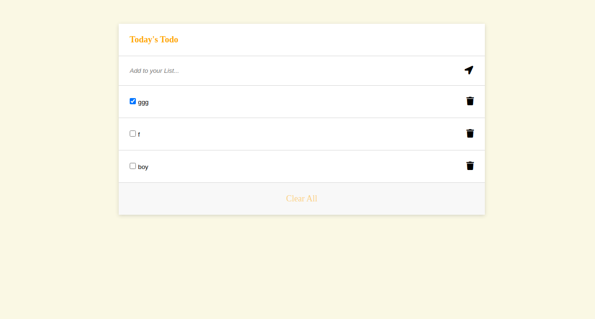

# ToDO LIST

This app helps users to organize and add tasks efficiently. It allows users paln their and manage their pending tasks.

## Preview

Elements of the user interface are fully functional(The create, delete, filter, drag and drop functions). Users will be able to check the taks they have completed and also clear them.

## Built With

- HTML 
- CSS
- Javascript
- Webpack
- HTML & CSS & JavaScript Linters
- GIT
- ES6

## DEMO

[LIVE DEMO LINK](https://olawalecoder.github.io/todo-list/)

## Getting Started

To get a local copy up and running follow these simple example steps.

### Prerequisites

clone repo: `git@github.com:olawalecoder/todo-list.git`

then
`cd todo-list`

### Install
- Open the your terminal with your code editor and run the commands below:

   - Run `npm install` to install all dependencies
   - Run `npm run build` to build the app with webpack configuration.
   - Run `npm start` and go to `http://localhost:8080//` to launch the server.

## Author

👤 **Olawale Bamidele**

- Location: Nigeria
- GitHub: [@olawalecoder](https://github.com/olawalecoder)
- Twitter: [@olawalecoder](https://twitter.com/olawalecoder)
- LinkedIn: [LinkedIn](https://linkedin.com/in/bamidele-olawale-072975142)

## 🤝 Contributing
Contributions, issues, and feature requests are welcome!

Feel free to check the [issues page](https://github.com/olawalecoder/todo-list/issues).

## Show your support
Give a ⭐️ if you like this project!

## Acknowledgments
-  Minimlistic Website
- Entire Microverse community

## 📝 License
This project is [MIT](./MIT.md) licensed.
